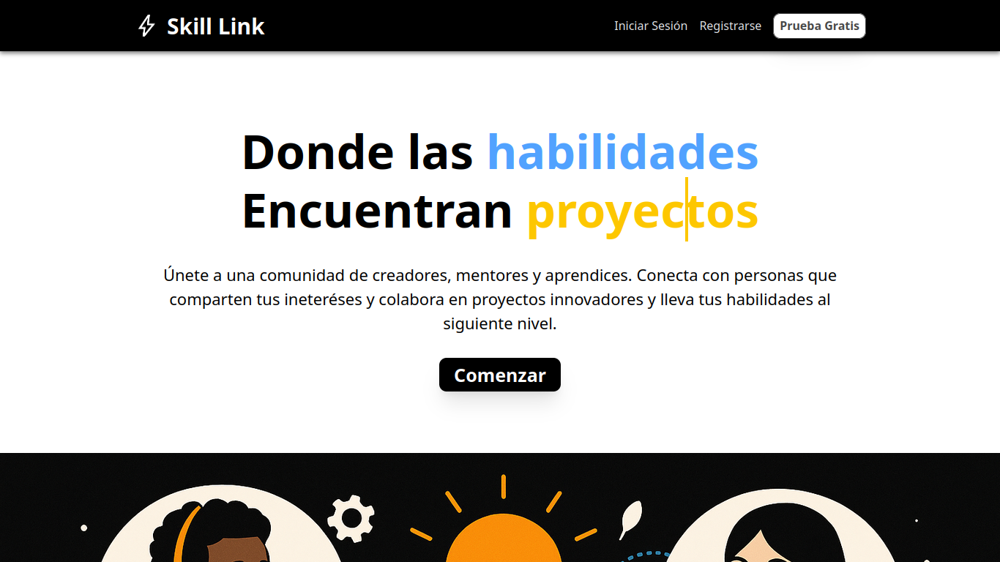

# SkillLink



## Guía de Instalación y Uso

### Requisitos Previos

Asegúrate de tener instalados los siguientes programas en tu sistema antes de comenzar:

- [Node.js](https://nodejs.org/) (versión 16 o superior recomendada)
- [npm](https://www.npmjs.com/)como gestor de paquetes
- [bun](https://bun.sh/) (opcional)
- [Git](https://git-scm.com/) para clonar el repositorio
<br>
<br>
### Instalación

Sigue estos pasos para instalar y configurar el proyecto en tu máquina local:

1. Clona el repositorio:

   ```bash
   git clone https://github.com/dierez00/SkillLink---Jedi.git
   ```

2. Navega al directorio del proyecto:

   ```bash
   cd frontend/SkillLink
   ```

3. Instala las dependencias necesarias:

   ```bash
   npm install
   ```

   O si prefieres usar `bun`:

   ```bash
   bun install
   ```

### Uso

Para iniciar el proyecto en un entorno de desarrollo, ejecuta:

```bash
npm run dev
```

O con `bun`:

```bash
bun run dev
```

Esto iniciará un servidor de desarrollo y podrás acceder al proyecto en tu navegador en [http://localhost:5173](http://localhost:5173) (o el puerto que se indique en la consola).

### Scripts Disponibles

- `npm run dev` / `bun run  dev`: Inicia el servidor de desarrollo.
- `npm run build` / `bun run build`: Genera una versión optimizada para producción.
- `npm run preview` / `bun run preview`: Previsualiza la versión de producción generada.
- `npm run lint` / `bun run lint`: Ejecuta el linter para verificar el código.

### Estructura del Proyecto

El proyecto está organizado de la siguiente manera:

```
SkillLink/
├── public/              # Archivos estáticos (favicon, imágenes públicas)
├── src/                 # Código fuente del proyecto
│   ├── assets/          # 🎨 Imágenes, íconos SVG, fuentes, logos
│   │   ├── icons/
│   │   └── images/
│   ├── components/      # 🧩 Componentes organizados
│   │   ├── common/      # Header, Footer, Layouts simples
│   │   ├── features/    # Componentes por funcionalidad/dominio
│   │   ├── layouts/     # Layouts principales (DashboardLayout, AuthLayout)
│   │   ├── modals/      # Modales centralizados
│   │   └── ui/          # Componentes atómicos y reutilizables (Button, Input)
│   ├── context/         # 🧠 Context API providers
│   ├── hooks/           # 🪝 Custom hooks reutilizables
│   ├── lib/             # 🧰 Helpers, funciones utilitarias
│   ├── pages/           # 🧭 Rutas React Router
│   ├── services/        # 🌐 API clients, llamadas a endpoints
│   ├── types/           # 📐 Tipos globales TypeScript
│   ├── App.tsx
│   ├── main.tsx
│   ├── styles.css
│   └── vite-env.d.ts
├── .gitignore
├── eslint.config.js
├── index.html
├── package.json
├── package-lock.json
├── README.md
├── tsconfig.json        # Configuración TypeScript
├── tsconfig.app.json
├── tsconfig.node.json
└── vite.config.ts
```

### Contribución

Si deseas contribuir al proyecto, sigue estos pasos:

1. Haz un fork del repositorio.
2. Crea una nueva rama para tu funcionalidad o corrección de errores:

   ```bash
   git checkout -b mi-nueva-funcionalidad
   ```

3. Realiza tus cambios y haz un commit:

   ```bash
   git commit -m "Agrega mi nueva funcionalidad"
   ```

4. Sube tus cambios a tu fork:

   ```bash
   git push origin mi-nueva-funcionalidad
   ```

5. Abre un Pull Request en el repositorio original.
